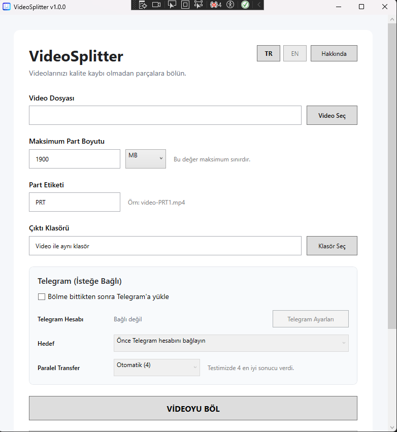
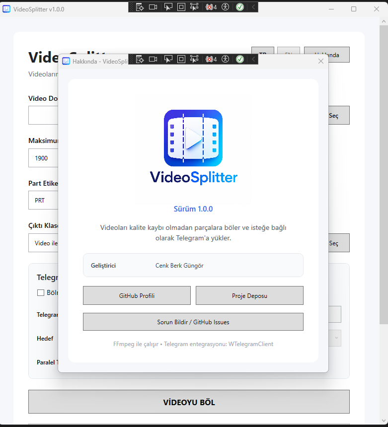

<div align="center">


# VideoSplitter

**Split videos without re-encoding and optionally upload the parts to Telegram.**

[](https://github.com/cenkberkgungor/TelegramVideoSplitter/releases)
[](https://github.com/cenkberkgungor/TelegramVideoSplitter/releases/download/v1.1.0/VideoSplitter-v1.1.0-win-x64.zip)
[](https://github.com/cenkberkgungor/TelegramVideoSplitter/releases)
[](LICENSE)

### [⬇️ Download VideoSplitter v1.1.0 for Windows x64](https://github.com/cenkberkgungor/TelegramVideoSplitter/releases/download/v1.1.0/VideoSplitter-v1.1.0-win-x64.zip)

[GitHub Profile](https://github.com/cenkberkgungor) ·
[Repository](https://github.com/cenkberkgungor/TelegramVideoSplitter) ·
[Releases](https://github.com/cenkberkgungor/TelegramVideoSplitter/releases) ·
[Issues](https://github.com/cenkberkgungor/TelegramVideoSplitter/issues)

</div>

---

## Screenshots

### Main window

<p align="center">
  
</p>

### About window

<p align="center">
  
</p>

---

## 🇹🇷 Türkçe

### VideoSplitter nedir?

VideoSplitter, videoları **yeniden encode etmeden** parçalara ayırmak için geliştirilmiş bir Windows masaüstü uygulamasıdır.

FFmpeg'in stream-copy özelliğini kullanarak video ve ses akışlarını yeniden sıkıştırmadan böler. Böylece mümkün olduğu durumlarda görüntü ve ses kalitesi korunur.

İsteğe bağlı Telegram entegrasyonu sayesinde oluşturulan video parçaları doğrudan:

- Kayıtlı Mesajlar
- Gruplar
- Süper gruplar
- Yetkili olduğunuz kanallar

gibi hedeflere yüklenebilir.

### Özellikler

- 🎬 Yeniden encode etmeden video bölme
- ✨ Kalite kaybını önleyen `-c copy` yaklaşımı
- 📦 Kullanıcı tarafından belirlenen maksimum part boyutu
- 🏷️ Özel part etiketi desteği
- ⚡ MP4/M4V/MOV için Fast Start desteği
- 📤 İsteğe bağlı Telegram yükleme
- 🚀 Paralel Telegram transferi
- 🖼️ Birden fazla video partını Telegram albümü / grouped media olarak gönderme
- 🖼️ Telegram videoları için otomatik thumbnail oluşturma
- ▶️ Telegram üzerinde stream edilebilir video metadata desteği
- 📊 İlerleme yüzdesi, geçen süre ve kalan süre
- 📈 Telegram yükleme hızının görüntülenmesi
- ❌ İşlem iptal desteği
- 📂 Çıktı klasörünü doğrudan açma
- 🇹🇷 Türkçe arayüz
- 🇬🇧 İngilizce arayüz
- 🔐 Telegram API bilgilerini Windows kullanıcı hesabına bağlı şekilde korumalı saklama

### Nasıl çalışır?

VideoSplitter videoyu yeniden encode etmek yerine FFmpeg ile mevcut video ve ses akışlarını yeni dosyalara kopyalar.

```text
Girdi videosu
     ↓
FFmpeg stream copy
     ↓
Boyut kontrollü segmentler
     ↓
MP4 Fast Start
     ↓
Part 1 / Part 2 / Part 3 ...
     ↓
İsteğe bağlı Telegram yükleme
```

> Not: Kesme noktaları videonun keyframe yapısına bağlıdır. Bu nedenle part süreleri her videoda tam olarak aynı olmayabilir.

### Dosya adlandırma

```text
Orijinal:
video.mp4

Part etiketi:
PRT

Çıktı:
video-PRT1.mp4
video-PRT2.mp4
video-PRT3.mp4
```

### Telegram entegrasyonu

Telegram yükleme özelliği tamamen isteğe bağlıdır.

Telegram etkinleştirildiğinde uygulama:

1. Video metadata bilgilerini FFprobe ile okur.
2. Video için otomatik thumbnail oluşturur.
3. Dosyayı Telegram'a yükler.
4. Süre, çözünürlük ve streaming bilgilerini Telegram'a gönderir.
5. Geçici thumbnail dosyasını işlem sonunda siler.

### İndirme

Hazır Windows x64 sürümü:

**[VideoSplitter v1.1.0 indir](https://github.com/cenkberkgungor/TelegramVideoSplitter/releases/download/v1.1.0/VideoSplitter-v1.1.0-win-x64.zip)**

ZIP dosyasını çıkartın ve:

```text
VideoSplitter.exe
```

dosyasını çalıştırın.

Bu paket **self-contained** olarak yayınlandığı için ayrıca .NET 10 yüklemeniz gerekmez.

### Kaynak koddan derleme

Gereksinimler:

- Windows
- Visual Studio 2026 veya uyumlu yeni sürüm
- .NET 10 SDK
- WPF
- FFmpeg / FFprobe
- WTelegramClient

Repository'yi klonlayın:

```bash
git clone https://github.com/cenkberkgungor/TelegramVideoSplitter.git
```

Solution'ı Visual Studio ile açın, NuGet paketlerini restore edin ve `Release` yapılandırması ile derleyin.

### Telegram kurulumu

Telegram yükleme özelliğini kullanmak için kendi Telegram API bilgileriniz gerekir.

API bilgilerinizi:

- Başka kişilerle paylaşmayın.
- GitHub repository'sine commit etmeyin.
- Ekran görüntülerinde açık şekilde göstermeyin.

### Gizlilik

VideoSplitter'ın video bölme işlemi yerel bilgisayarınızda yapılır.

Telegram yükleme özelliği kapalıysa videolar Telegram'a gönderilmez.

Telegram özelliği açıkken yalnızca seçtiğiniz çıktı parçaları seçtiğiniz Telegram hedefine yüklenir.

---

## 🇬🇧 English

### What is VideoSplitter?

VideoSplitter is a Windows desktop application designed to split videos into smaller parts **without re-encoding**.

It uses FFmpeg stream copy whenever possible, preserving the original encoded video and audio streams instead of compressing them again.

Optional Telegram integration can upload generated video parts directly to:

- Saved Messages
- Groups
- Supergroups
- Channels where the account has permission to post

### Features

- 🎬 Split videos without re-encoding
- ✨ Stream-copy workflow using `-c copy`
- 📦 User-defined maximum part size
- 🏷️ Custom part labels
- ⚡ Fast Start support for MP4/M4V/MOV
- 📤 Optional Telegram upload
- 🚀 Parallel Telegram transfers
- 🖼️ Send multiple video parts as a Telegram grouped-media album
- 🖼️ Automatic Telegram video thumbnails
- ▶️ Streaming-friendly Telegram video metadata
- 📊 Progress, elapsed time and estimated remaining time
- 📈 Telegram upload speed display
- ❌ Cancellation support
- 📂 Open output folder directly
- 🇹🇷 Turkish interface
- 🇬🇧 English interface
- 🔐 Telegram API settings protected for the current Windows user

### Download

Ready-to-run Windows x64 build:

**[Download VideoSplitter v1.1.0](https://github.com/cenkberkgungor/TelegramVideoSplitter/releases/download/v1.1.0/VideoSplitter-v1.1.0-win-x64.zip)**

Extract the ZIP file and run:

```text
VideoSplitter.exe
```

The release is self-contained, so a separate .NET 10 installation is not required.

### Build from source

Requirements:

- Windows
- Visual Studio 2026 or a compatible newer version
- .NET 10 SDK
- WPF
- FFmpeg / FFprobe
- WTelegramClient

Clone:

```bash
git clone https://github.com/cenkberkgungor/TelegramVideoSplitter.git
```

Open the solution in Visual Studio, restore NuGet packages, ensure FFmpeg binaries are available, and build using the `Release` configuration.

---

## Version

Current release:

```text
v1.1.0
```

Semantic versioning:

```text
1.0.0 → Initial stable release
1.1.0 → Telegram grouped media / album uploads
1.1.0 → New features
1.1.1 → Bug fixes
2.0.0 → Major changes
```

## Third-party components

VideoSplitter uses:

- [FFmpeg](https://ffmpeg.org/)
- [WTelegramClient](https://github.com/wiz0u/WTelegramClient)

Please refer to the respective projects for their own licenses and terms.

## License

This project is licensed under the **MIT License**.

See [LICENSE](LICENSE) for details.

## Developer

**Cenk Berk Güngör**

GitHub: https://github.com/cenkberkgungor

## Contributing

Issues and suggestions are welcome:

https://github.com/cenkberkgungor/TelegramVideoSplitter/issues

## Disclaimer

VideoSplitter is an independent project and is not affiliated with or endorsed by Telegram or FFmpeg.
